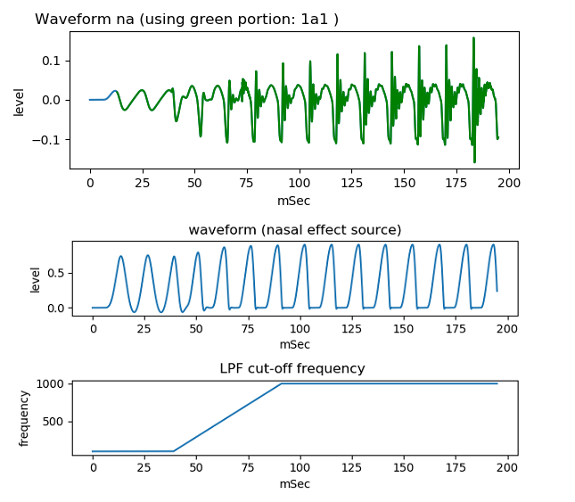
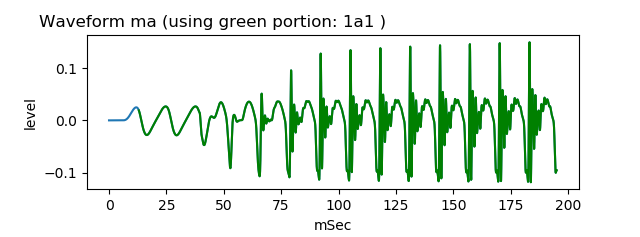

# vocal tract tube nasal model   
   
This is an experiment to generate nasal voice /na/ /ma/ sound by two tubes model and nasal effect source.  
  
[github repository](https://github.com/shun60s/Vocal-Tube-N-Model)  

## usage   

Generate pseudo nasal voice /na/   
```
python3 main2varloss_1na.py
```
  

This will save yout_na_1a1_varloss0_01_stdarea2_0_long.wav that sounds similar to voice /na/ sound.  
<br />

Generate pseudo nasal voice /ma/   
```
python3 main2varloss_1ma.py
```
  

This will save yout_ma_1a1_varloss0_01_stdarea2_0_long.wav that sounds similar to voice /ma/ sound.  


## Document  

For more information, please see related WEB [Nasal voice /na/ /ma/ sound waveform generation by two tubes model and nasal effect source](https://wsignal.sakura.ne.jp/onsei2007/python6-e.html) or
[same content in Japanese](https://wsignal.sakura.ne.jp/onsei2007/python6.html)  


## License    
MIT  

